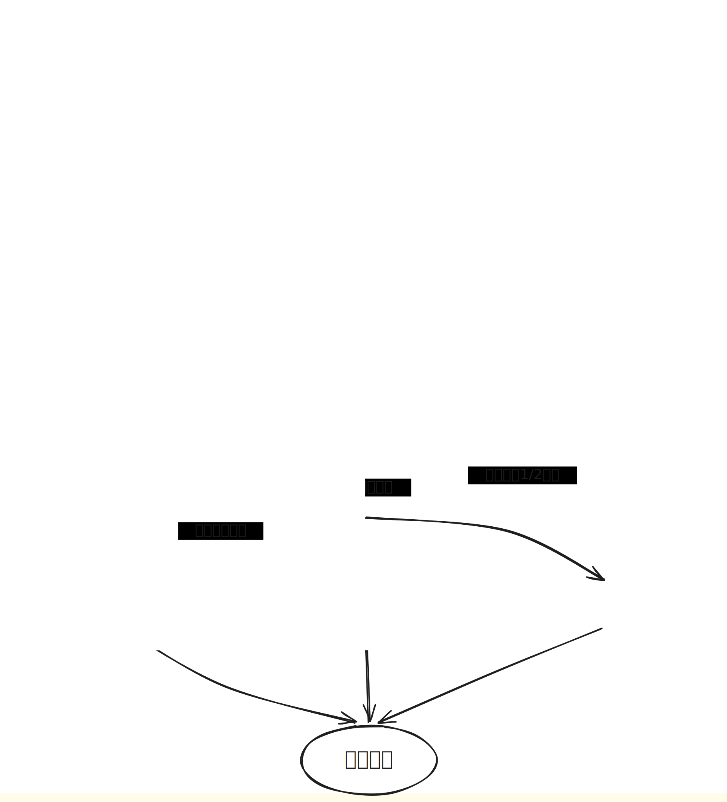
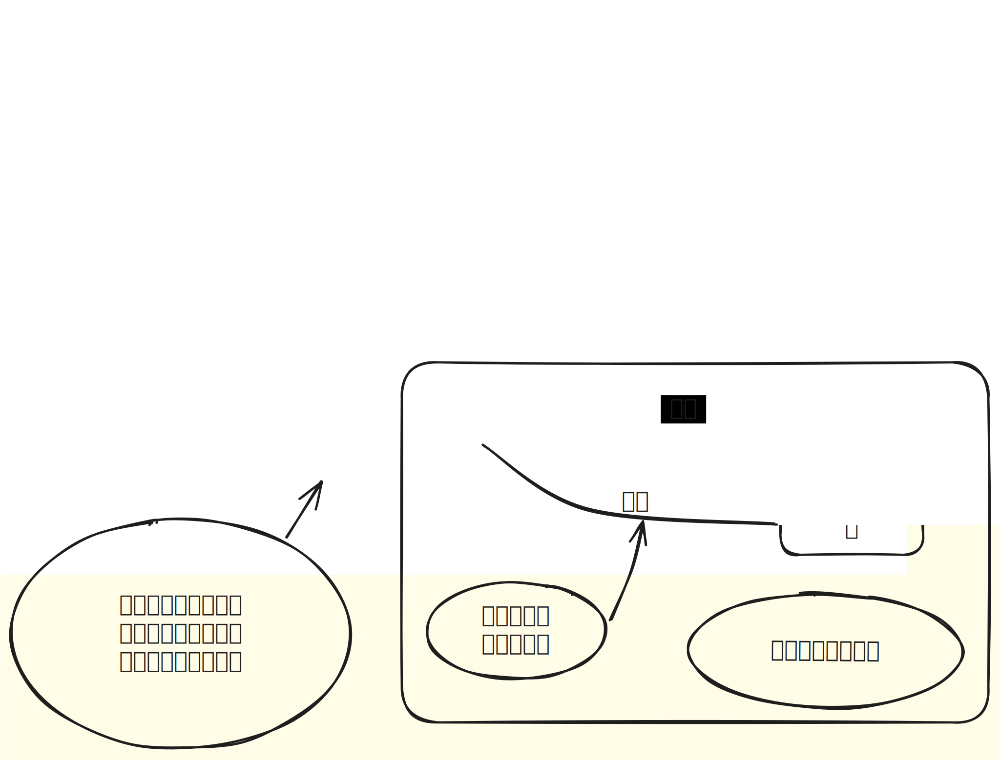

# 我是怎么管理银行卡和分配收入的

> 个人经验分享，仅供参考。每个人的收入和支出结构不同，适合我的不一定适合你。

---

## 为什么要把这件事理清楚

以前我的银行卡是一个「黑洞」——工资进来，慢慢花掉，月底一看余额，完全不知道钱花哪去了。有时候想存钱，结果拖到月底，能剩下的已经不多了。

后来我开始研究怎么把钱**「隔开」**，用不同的卡承担不同的职责。花了几天时间捋清楚，画了两张图来梳理整个体系，现在这套方法用起来顺手多了。

**核心思路就一句话：金钱分散，降低风险；灵活用卡，提高限额。**

---

## 我的卡体系

我用多张卡各司其职，通过云闪付统一管理和互转：

### 主账户与中转

| 卡名 | 角色 | 说明 |
|------|------|------|
| **卡89** | 主卡 | 所有资金入口，从这里按比例分流 |
| **卡S** | 通过银联转账接收 | 接收银联通道资金 |

### 云闪付统筹区（金额可互转）

| 卡名 | 角色 | 说明 |
|------|------|------|
| **卡j** | 绑定虚拟卡/消费 | 绑定卡s用于互传 |
| **卡n** | 备用卡/消费 | 在云闪付体系内统一调度 |
| **卡s** | 中转卡/消费卡 | 中转万事达到卡 S，连接内外通道 |

### 探索与消费区

| 卡名 | 角色 | 说明 |
|------|------|------|
| **卡g** | 探索账户 | 小项目三方平台收支（暂时）；**盈利平衡通讯支出** |
| **消费卡35** | 日常消费 | 约占收入 10%，绑定三方支付平台进行消费 |

**实际使用原则：**
- 云闪付统一管理大部分卡片，支持金额互转，方便调度，统一查看金额。
- 非银联卡使用中转卡s/银行app银联转账。
- 消费卡使用任何的三方平台进行绑定支付
- 腾讯文档用于探索项目做报表和账单管理，计算收支。

---

## 资金是怎么流转的

以**卡89**为中心，按比例自动分流(**比例仅供参考，因人而异**)；

### 四个去向的说明

| 占比 | 去向 | 用途 |
|------|------|------|
| **约 10%** | → 消费卡35 → 三方平台 | 当月生活费，吃穿住行等日常开销 |
| **2.5%–3%** | → 支付宝 / 攒着 | 活钱，临时救急；花呗用于商户补充使用 |
| **50%–60%** | → 招商 app（定期 / 活期 / 稳健） | 低风险投资为主，**收益回报的一半再转入继续滚动** |
| **30%–35%** | → 余额宝 / 招商基金活期 → 基金 | 中高风险投资部分，追求更高收益 |

---

## 我的几条管理规则

1. **先存后花。** 工资到账第一件事是按比例分流，而不是等到月底剩多少存多少。人的自控力有限，别考验它。

2. **金钱分散，降低风险。** 不把鸡蛋放一个篮子里。云闪付统筹多张卡，每张卡有明确分工，一张出问题不影响整体。

3. **灵活用卡，提高限额。** 多卡联动不只是为了分钱，也是为了提高可用额度。绑虚拟卡、走万事达通道、利用不同银行的优惠活动。*“或许这是通向虚拟世界的大门”，努力突破认知的上限*

4. **收益再投入。** 投资部分的收益不完全取出来消费，而是拿出一半（约 1/2）继续转入投资，让钱自己生钱。

5. **探索账户—用腾讯文档记账。** 不依赖单一 APP 的统计功能，自己用文档做报表和账单，数据掌握在自己手里。

6. **留足活钱。** 2.5%–3% 放在随时能取的地方，加上花呗作为缓冲，确保临时救急时不用动投资仓位。

---

## 还在调整的地方

这套方法还在检验期，整体感觉还不错，但也有几个点还在摸索：

- **比例会根据月份微调。** 有些月有大额支出（换手机、交保费之类），当月的投资比例就会降一点，后面补回来。不用追求每个月都严格达标。
- **中高风险投资的仓位控制还在找感觉。** 30%–35% 里有多少给中高风险，多少留在活期，这个比例我会根据市场情况动态调。
- **卡的用途边界偶尔会模糊。** 定位还不太固定，有时候会临时挪用，后面打算给它一个更明确的职责。

---

## 最后想说的

这套方法的核心理念其实很简单——**把每笔钱安排好去处，让它知道自己该干什么**。以前所有钱混在一张卡里，花起来没感觉；现在四条路分开走，每一笔都有它的使命，反而更愿意坚持了。

如果你也在纠结怎么管银行卡和分配收入，希望这篇分享能给你一些思路。不用照搬我的比例或卡数，理解背后的逻辑，按自己的情况设计就好。

---

*写于 2026 年 6 月21日 · 个人经验，非专业理财建议*
