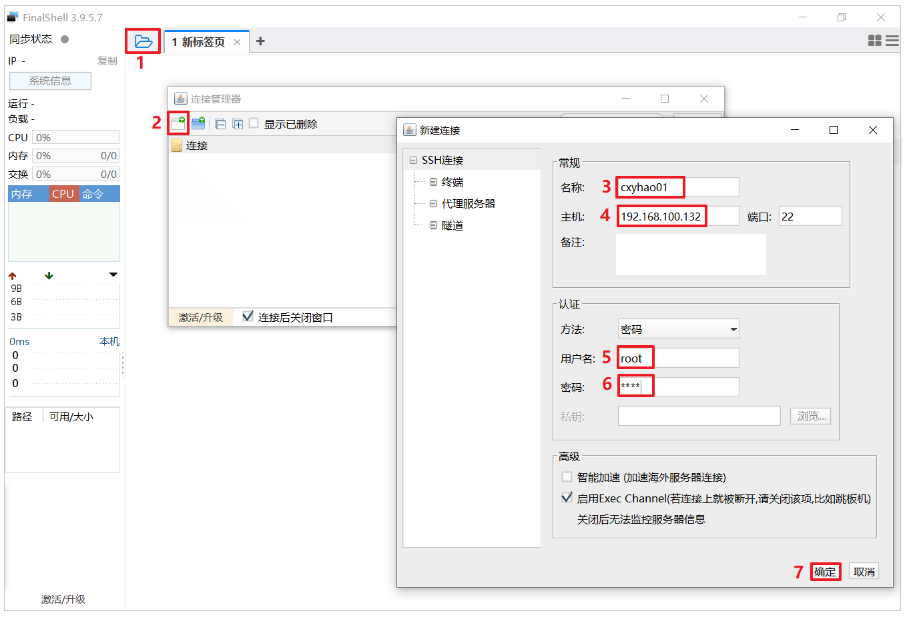
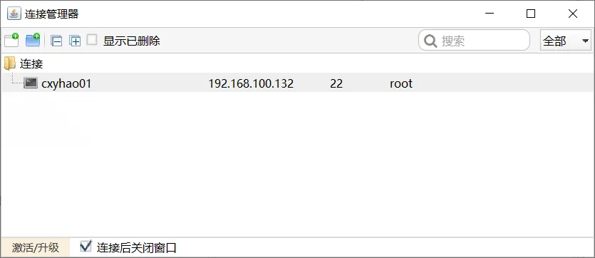
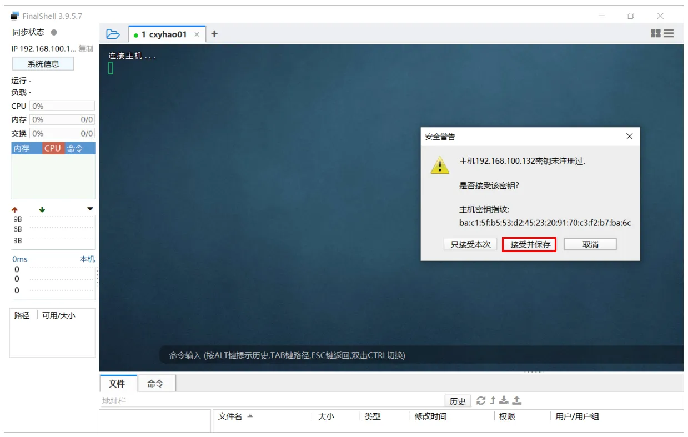
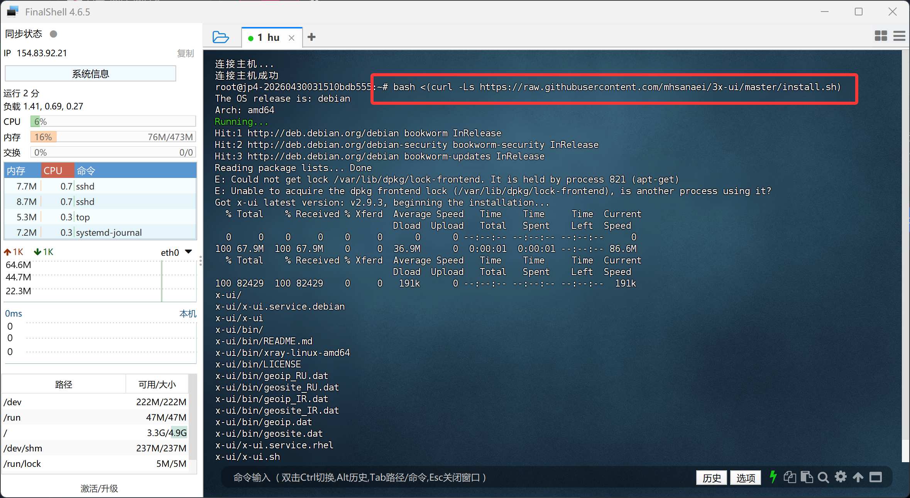
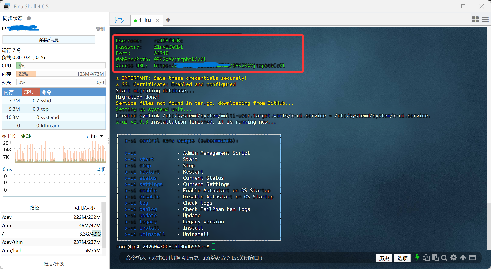
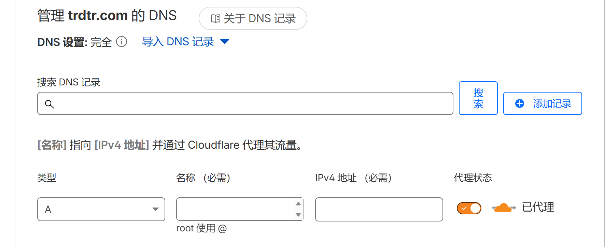
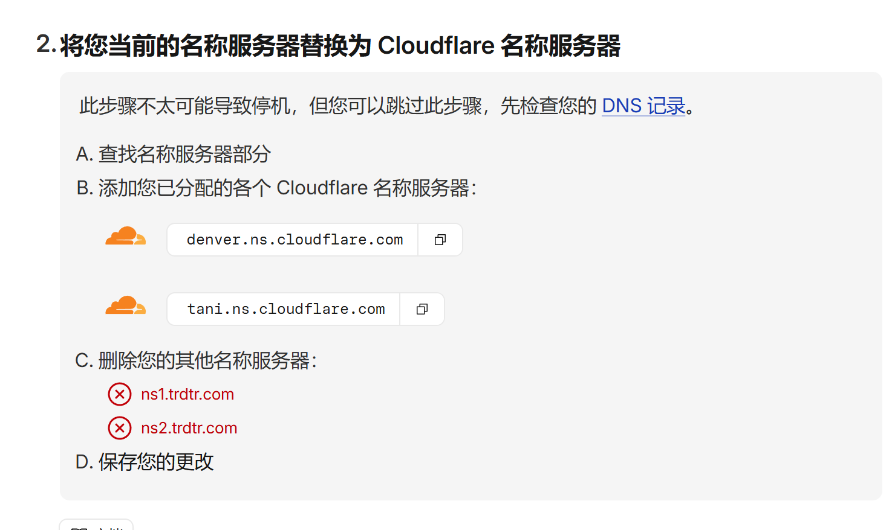
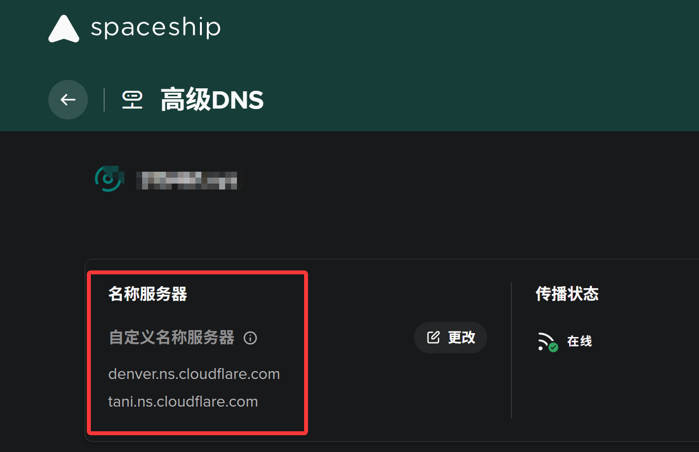
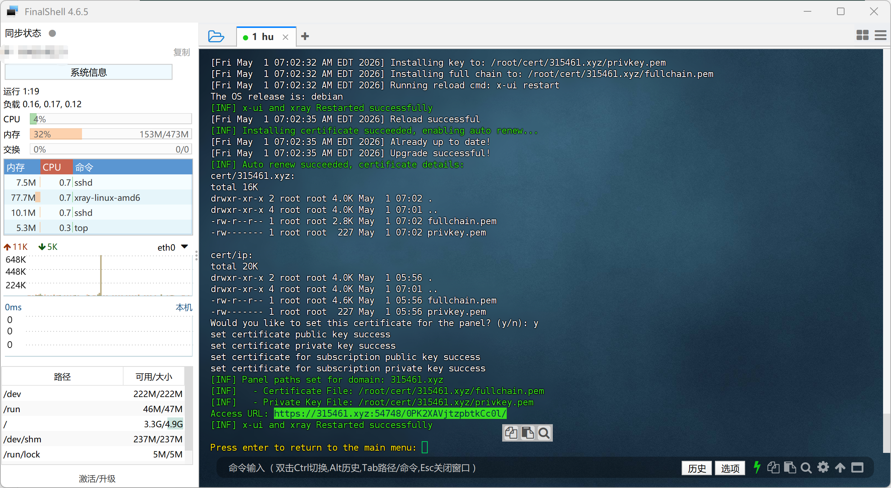

# 基于vps搭建个人节点及使用

## 1.购买云服务器

购买平台：[AkileCloud – 大带宽流媒体解锁VPS](https://akile.ai/)

根据自己的需求进行购买，自己无需配置DNS

## 2.启动服务器

选择debian13（1GB）/Debian12（512mb）系统，括号为推荐内存要求

## 3.使用ssh链接服务器，

3.1软件是[FinalShell SSH工具,服务器管理,远程桌面加速软件,支持Windows,macOS,Linux,版本4.6.3,更新日期2025.5.21 - FinalShell官网](https://www.hostbuf.com/t/988.html)

使用**ssh连接**我们的服务器，输入对应的主机ip，用户名和密码，点击应用。弹出的安全警告选择接受并保存。

3.2看到如下效果，说明已经创建了一个连接

3.3双击这个连接，第一次连接会出现如下效果:

## 4.安装3x-ui

github主页：[MHSanaei/3x-ui: Xray panel supporting multi-protocol multi-user expire day & traffic & IP limit (Vmess, Vless, Trojan, ShadowSocks, Wireguard, Hysteria, Tunnel, Mixed, HTTP, Tun)](https://github.com/MHSanaei/3x-ui)

安装命令在GitHub主页，**复制Quick Start下面的命令**即可

```bash
bash <(curl -Ls https://raw.githubusercontent.com/mhsanaei/3x-ui/master/install.sh)
```

进入远程主机,输入安装命令

后面默认一直点enter跳过，留意出现下图就是安装成功了。注意保存登录信息

到达这一步基本就可以了。可以正常使用了。使用对应地址进行登录即可如果无法进入，可以把https去掉s再进行。不安全是正常现象。

## 5.新建入站

## 6.购买/续费域名。

> 使用支付宝，尽量在电脑上操作。网络不畅建议开代理

平台：[迈向未来 - Spaceship](https://www.spaceship.com/zh/)

> 域名选择六位数字的xyz或者其他后缀即可，这样比较便宜。

购买尽量选择非大陆的注册地，其他信息可以填写虚假个人信息。对应地区搜索写入。

## 7.托管到cloudflare

注册登录

在主页添加链接域名(点击左侧域名-概述-添加域名)。填写完域名后，其他的不改，直接继续。选择免费套餐。下图的填写实例见表

| 设置项   | 实例                | 说明                                       |
| -------- | ------------------- | ------------------------------------------ |
| 类型     | A                   |                                            |
| 名称     | 写自定义前缀或者写@ | 二级域名的前缀比如www，@=前缀为空=只有域名 |
| ipv4     | 填写服务器ip        | 你的主机ip                                 |
| 代理状态 | 关闭                | 本指南使用关闭即可，高阶的自行探索         |



设置完整后点击继续/激活，第一步不看，看第二步替换原有dns服务器

回到我们购买域名的平台，找到对应域名dns服务器设置，替换为cloud flare的名称服务器。

## 8.配置面板域名

回到ssh链接的桌面，输入x-ui回车后选择**SSL Certificate Management** ——**Get SSL (Domain)**——输入注册的域名——端口默认enter——ACME选择**n**——Would you like to set this certificate for the panel? (y/n):**y**

出现下图就是成功了
